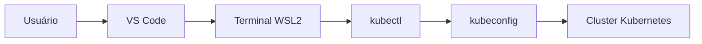
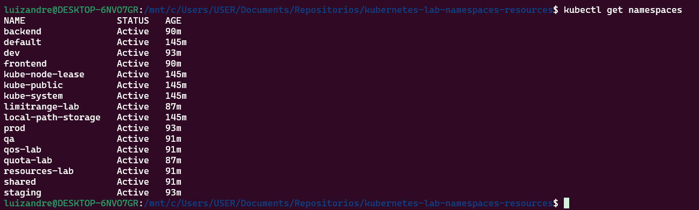
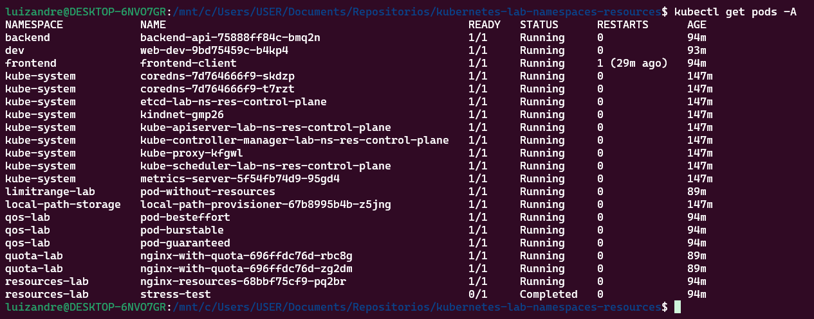
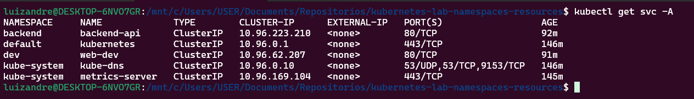
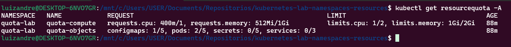
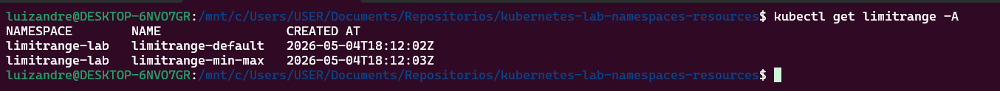
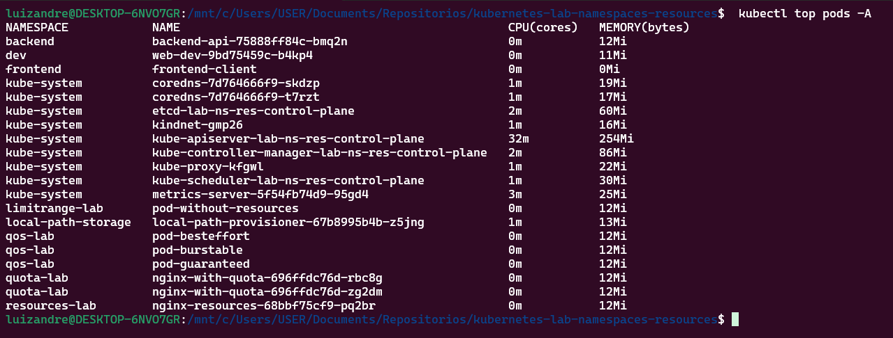
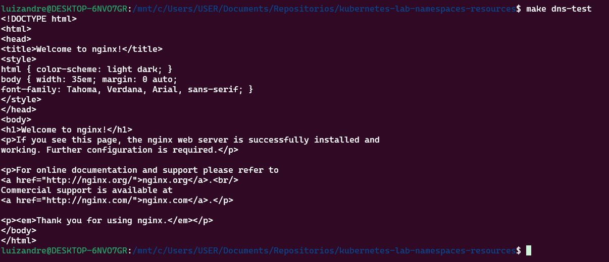
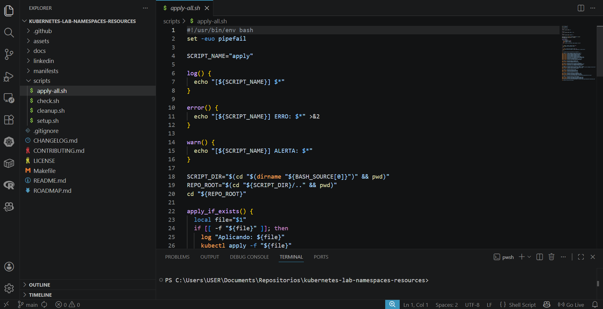

# Kubernetes Lab: Namespaces, Resources, QoS e Resource Quotas


> ✅ Projeto executado e validado na prática no cluster `kind-lab-ns-res` (WSL2 + Windows 11), com evidências de DNS entre namespaces, QoS, LimitRange, ResourceQuota e métricas de pods.

## Stack validada no laboratório

`Kubernetes` | `WSL2` | `Docker` | `Kind` | `kubectl` | `DevOps` | `Cloud Native` | `Engenharia de Dados`

## Sobre o projeto

Este repositório documenta uma jornada prática de Kubernetes voltada a cenários reais de operação de cluster, governança de recursos e troubleshooting.

O conteúdo foi estruturado para apoiar profissionais em início de carreira em Engenharia de Dados, DevOps e Cloud, com foco em execução prática e não apenas em teoria.

O projeto combina documentação objetiva, manifests versionados e scripts de automação para setup, aplicação, checagem e limpeza. O resultado é um laboratório reproduzível, didático e profissional para portfólio técnico, entrevistas e LinkedIn.

> Está avaliando este projeto como recrutador? Veja o resumo executivo em [docs/README-recrutadores.md](docs/README-recrutadores.md).
>
> Quer divulgar no LinkedIn? Use os materiais em `linkedin/post-linkedin.md`, `linkedin/carrossel-linkedin.md` e `linkedin/resumo-projeto.md`.

## Problema que este projeto resolve

Muitos profissionais aprendem Kubernetes apenas no nível conceitual e não chegam a validar cenários operacionais completos em ambiente real.

Este laboratório resolve essa lacuna com cenários executáveis, comandos diretos, YAMLs prontos para uso e validações técnicas observáveis:

- isolamento por namespaces
- comunicação entre serviços via DNS interno
- governança de CPU/memória com requests, limits, LimitRange e ResourceQuota
- validação de QoS e métricas operacionais

Com isso, o projeto demonstra capacidade de implementação, validação e troubleshooting em cluster Kubernetes local, com práticas que se conectam ao contexto de times e ambientes corporativos.

## Conceitos abordados

- Namespaces
- DNS entre namespaces
- Kubeconfig
- Múltiplos clusters
- `kubectl config`
- `kubectx` e `kubens`
- Metrics Server
- CPU request e CPU limit
- Memory request e Memory limit
- QoS
- LimitRange
- ResourceQuota
- Boas práticas

## Arquitetura do laboratório



## Pré-requisitos

- Windows 11
- WSL2
- Ubuntu 22.04
- Docker
- `kubectl`
- `k3d` ou `kind` ou `minikube`
- VS Code
- Git
- GitHub

## Como executar

```bash
chmod +x scripts/*.sh
./scripts/setup.sh
./scripts/apply-all.sh
./scripts/check.sh
./scripts/cleanup.sh
```

Observação: se você quiser forçar o provisionador no setup, use `./scripts/setup.sh kind` ou `./scripts/setup.sh k3d`.

## Executando com Makefile

O `Makefile` é opcional, mas facilita a vida de quem for testar o projeto localmente, concentrando os comandos principais em alvos simples.

```bash
make help
make setup
make apply
make check
make status
make dns-test
make qos-test
make metrics
make quota
make limitrange
make cleanup
```

Observação: `make apply` (scripts/apply-all.sh) não aplica automaticamente os manifestos didáticos que geram erro proposital:

- `manifests/limitrange/pod-above-limit.yaml`
- `manifests/resourcequota/deployment-exceed-quota.yaml`

## Qualidade e validação automática

Este projeto possui GitHub Actions para validar os manifests Kubernetes a cada alteração em `main` (push e pull request), sem depender de cluster externo.

Validações aplicadas automaticamente:

- sintaxe YAML dos arquivos em `manifests/` com `yamllint`
- estrutura de manifests Kubernetes com `kubeconform` (validação offline)

Workflow:

- `.github/workflows/validate-kubernetes-yaml.yml`

Templates de colaboração no GitHub:

- Issues: `.github/ISSUE_TEMPLATE/bug_report.md`, `.github/ISSUE_TEMPLATE/melhoria.md`, `.github/ISSUE_TEMPLATE/pergunta.md`
- Pull requests: `.github/pull_request_template.md`
- Guia de contribuição: [CONTRIBUTING.md](CONTRIBUTING.md)
- Histórico de mudanças: [CHANGELOG.md](CHANGELOG.md)

## Roadmap

Para acompanhar a evolução futura do laboratório, consulte o roadmap do projeto:

- [ROADMAP.md](ROADMAP.md)

## Navegação rápida

- [Conceitos abordados](#conceitos-abordados)
- [Stack validada no laboratório](#stack-validada-no-laboratório)
- [Executando com Makefile](#executando-com-makefile)
- [Qualidade e validação automática](#qualidade-e-validação-automática)
- [Roadmap](#roadmap)
- [Changelog](CHANGELOG.md)
- [Resumo para recrutadores](docs/README-recrutadores.md)
- [Como contribuir](CONTRIBUTING.md)
- [Roteiro de estudo](#roteiro-de-estudo)
- [Evidências práticas de execução](#evidências-práticas-de-execução)
- [O que um recrutador técnico avalia aqui](#o-que-um-recrutador-técnico-avalia-aqui)
- [Screenshots do laboratório](#screenshots-do-laboratório)
- [Próximos passos](#próximos-passos)

## Estrutura do repositório

```text
.
├── .github/
│   ├── ISSUE_TEMPLATE/
│   │   ├── bug_report.md
│   │   ├── melhoria.md
│   │   └── pergunta.md
│   ├── pull_request_template.md
│   └── workflows/
│       └── validate-kubernetes-yaml.yml
├── CONTRIBUTING.md
├── CHANGELOG.md
├── Makefile
├── README.md
├── ROADMAP.md
├── LICENSE
├── .gitignore
├── docs/
│   ├── 00-introducao.md
│   ├── 01-namespaces.md
│   ├── 02-comunicacao-dns.md
│   ├── 03-multiplos-clusters-kubeconfig.md
│   ├── 04-resources-requests-limits.md
│   ├── 05-qos.md
│   ├── 06-limitrange.md
│   ├── 07-resourcequota.md
│   ├── 08-boas-praticas.md
│   ├── 09-evidencias-execucao.md
│   ├── 09-publicando-no-github.md
│   ├── 10-troubleshooting.md
│   └── README-recrutadores.md
├── manifests/
│   ├── namespaces/
│   ├── dns-cross-namespace/
│   ├── resources/
│   ├── qos/
│   ├── limitrange/
│   └── resourcequota/
├── scripts/
│   ├── setup.sh
│   ├── apply-all.sh
│   ├── check.sh
│   └── cleanup.sh
├── assets/
│   ├── diagrams/
│   └── screenshots/
└── linkedin/
    ├── carrossel-linkedin.md
    ├── post-linkedin.md
    └── resumo-projeto.md
```

## Roteiro de estudo

1. [Introdução](docs/00-introducao.md)
2. [Namespaces](docs/01-namespaces.md)
3. [Comunicação DNS entre namespaces](docs/02-comunicacao-dns.md)
4. [Múltiplos clusters e kubeconfig](docs/03-multiplos-clusters-kubeconfig.md)
5. [Requests e limits](docs/04-resources-requests-limits.md)
6. [QoS](docs/05-qos.md)
7. [LimitRange](docs/06-limitrange.md)
8. [ResourceQuota](docs/07-resourcequota.md)
9. [Boas práticas](docs/08-boas-praticas.md)
10. [Evidências de execução](docs/09-evidencias-execucao.md)
11. [Publicando no GitHub](docs/09-publicando-no-github.md)
12. [Troubleshooting](docs/10-troubleshooting.md)
13. [Resumo para recrutadores](docs/README-recrutadores.md)

## Evidências práticas de execução

As validações abaixo comprovam execução real do laboratório no cluster local, indo além de documentação teórica.

| Área validada | Evidência observada | Comando-chave |
|---|---|---|
| Cluster ativo | `kind-lab-ns-res` em execução | `kubectl config current-context` |
| DNS entre namespaces | `frontend` acessando `backend-api.backend.svc.cluster.local` | `kubectl exec -n frontend -it frontend-client -- curl backend-api.backend.svc.cluster.local` |
| QoS | `Guaranteed`, `Burstable` e `BestEffort` verificáveis | `kubectl describe pod pod-guaranteed -n qos-lab` |
| Governança de recursos | `LimitRange` e `ResourceQuota` aplicados | `kubectl describe quota -n quota-lab` |
| Métricas | consumo de CPU/memória visível por pod | `kubectl top pods -A` |

### 1. Cluster Kubernetes ativo

O laboratório foi validado com sucesso no cluster:

- `kind-lab-ns-res`

Ambiente validado:

- Windows 11
- WSL2
- Ubuntu
- Docker
- Kind
- kubectl
- VS Code

### 2. Namespaces criados

Foram criados namespaces para simular ambientes e laboratórios isolados:

- dev
- staging
- prod
- qa
- shared
- backend
- frontend
- resources-lab
- qos-lab
- limitrange-lab
- quota-lab

Comando de validação:

```bash
kubectl get namespaces
```

### 3. Comunicação DNS entre namespaces

Foi validado, na prática, que o namespace `frontend` acessa o namespace `backend` usando DNS interno completo do Kubernetes.

Comando executado:

```bash
kubectl exec -n frontend -it frontend-client -- curl backend-api.backend.svc.cluster.local
```

Fluxo técnico:

`frontend-client` -> `backend-api.backend.svc.cluster.local` -> Service `backend-api` -> Pod NGINX no namespace `backend`

Resultado observado:

- retorno da página padrão do NGINX com o texto `Welcome to nginx!`

Esse retorno confirma:

- Service discovery funcionando
- DNS interno funcionando
- Comunicação entre namespaces funcionando
- Service ClusterIP funcionando
- Pod backend respondendo corretamente

### 4. Validação de QoS

Comandos de validação:

```bash
kubectl describe pod pod-guaranteed -n qos-lab | grep -i "QoS Class"
kubectl describe pod pod-burstable -n qos-lab | grep -i "QoS Class"
kubectl describe pod pod-besteffort -n qos-lab | grep -i "QoS Class"
```

Resultados esperados:

- `QoS Class: Guaranteed`
- `QoS Class: Burstable`
- `QoS Class: BestEffort`

Resumo técnico:

- `Guaranteed`: requests e limits iguais
- `Burstable`: requests e limits definidos, mas diferentes
- `BestEffort`: sem requests e sem limits

### 5. ResourceQuota e LimitRange

Comandos de validação:

```bash
kubectl get resourcequota -A
kubectl get limitrange -A
kubectl describe quota -n quota-lab
kubectl describe limitrange -n limitrange-lab
```

Esses comandos demonstram políticas de controle de consumo de recursos no cluster, com governança por namespace.

### 6. Metrics Server

Comando de validação:

```bash
kubectl top pods -A
```

Esse comando valida a coleta de métricas de CPU e memória dos pods.

## O que um recrutador técnico avalia aqui

- Capacidade de executar Kubernetes na prática, além da teoria
- Organização de repositório com separação clara entre docs, manifests e scripts
- Uso de infraestrutura como código com YAML versionado
- Validação técnica com `kubectl get`, `kubectl describe`, `kubectl top` e testes de DNS interno
- Noções de governança de recursos para ambientes compartilhados
- Qualidade de comunicação técnica em documentação profissional

## Screenshots do laboratório

Adicione capturas reais de execução na pasta `assets/screenshots/` para comprovar, visualmente, que o laboratório foi aplicado e validado na prática.

| Evidência | Comando | Arquivo sugerido | O que comprova |
|---|---|---|---|
| Namespaces criados | `kubectl get namespaces` | `01-namespaces.png` | Separação lógica de ambientes e laboratórios no cluster |
| Pods em execução | `kubectl get pods -A` | `02-pods-running.png` | Workloads ativos em múltiplos namespaces |
| Services ativos | `kubectl get svc -A` | `03-services.png` | Exposição interna de serviços e descoberta por DNS |
| Quotas por namespace | `kubectl get resourcequota -A` | `04-resourcequota.png` | Políticas de consumo de recursos aplicadas |
| Limites padrão por namespace | `kubectl get limitrange -A` | `05-limitrange.png` | Padrões mínimos e máximos de CPU/memória configurados |
| Métricas de recursos | `kubectl top pods -A` | `06-metrics-server.png` | Metrics Server funcional e leitura de CPU/memória |
| DNS entre namespaces (execução prática) | `kubectl exec -n frontend -it frontend-client -- curl backend-api.backend.svc.cluster.local` | `07-dns-cross-namespace.png` | Comunicação `frontend` -> `backend` via DNS interno (`service.namespace.svc.cluster.local`) |
| Detalhes da ResourceQuota | `kubectl describe quota -n quota-lab` | `04-resourcequota.png` | Limites e consumo atual de CPU/memória/objetos no namespace |
| Detalhes do LimitRange | `kubectl describe limitrange -n limitrange-lab` | `05-limitrange.png` | Defaults, mínimos e máximos aplicados aos containers |
| Estrutura do projeto no editor | N/A (captura no VS Code) | `08-vscode-estrutura-projeto.png` | Organização profissional do repositório |
| README renderizado no GitHub | N/A (captura no navegador) | `09-github-readme.png` | Qualidade de documentação para recrutadores e comunidade |

Importante:

- Não invente imagens.
- Não crie arquivos PNG falsos.
- Salve apenas prints reais da execução em `assets/screenshots/`.

As imagens abaixo devem ser adicionadas após a execução local do laboratório.

### Namespaces criados


### Pods em execução


### Services criados


### ResourceQuota aplicada


### LimitRange aplicada


### Metrics Server coletando métricas


### Comunicação DNS entre namespaces


### Estrutura do projeto no VS Code


## Aprendizados demonstrados para recrutadores

Este projeto demonstra:

- Organização técnica
- Infraestrutura como código
- Kubernetes prático
- Troubleshooting
- Documentação profissional
- Clareza de comunicação

## Próximos passos

- Ingress
- Helm
- Volumes
- Secrets avançados
- Deploy de aplicação real
- CI/CD com GitHub Actions

## Autor

**Luiz André Souza**

- GitHub: https://github.com/brodyandre
- LinkedIn: https://www.linkedin.com/in/luiz-andre-souza-data-engineer/
