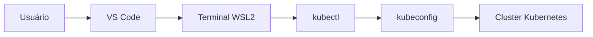

# Kubernetes Lab: Namespaces, Resources, QoS e Resource Quotas


## Sobre o projeto

Este repositório documenta uma jornada prática de estudos em Kubernetes, com foco em conceitos fundamentais usados no dia a dia de Engenharia de Dados, DevOps e Cloud.

O laboratório foi construído para transformar teoria em execução real, com documentação objetiva, manifests versionados e scripts de automação para setup, validação e limpeza do ambiente.

## Problema que este projeto resolve

Muitos profissionais estudam Kubernetes apenas na teoria, sem vivenciar cenários operacionais comuns do mundo real.

Este projeto resolve essa lacuna com exemplos práticos, comandos, YAMLs e validações reproduzíveis, permitindo entender comportamento de cluster, isolamento por namespace e governança de recursos de forma aplicada.

## Conceitos abordados

- Namespaces
- DNS entre namespaces
- Kubeconfig
- Múltiplos clusters
- `kubectl config`
- `kubectx` e `kubens`
- Metrics Server
- CPU request e CPU limit
- Memory request e Memory limit
- QoS
- LimitRange
- ResourceQuota
- Boas práticas

## Arquitetura do laboratório



## Pré-requisitos

- Windows 11
- WSL2
- Ubuntu 22.04
- Docker
- `kubectl`
- `k3d` ou `kind` ou `minikube`
- VS Code
- Git
- GitHub

## Como executar

```bash
chmod +x scripts/*.sh
./scripts/setup.sh
./scripts/apply-all.sh
./scripts/check.sh
./scripts/cleanup.sh
```

Observação: se você quiser forçar o provisionador no setup, use `./scripts/setup.sh kind` ou `./scripts/setup.sh k3d`.

## Estrutura do repositório

```text
.
├── README.md
├── LICENSE
├── .gitignore
├── docs/
│   ├── 00-introducao.md
│   ├── 01-namespaces.md
│   ├── 02-comunicacao-dns.md
│   ├── 03-multiplos-clusters-kubeconfig.md
│   ├── 04-resources-requests-limits.md
│   ├── 05-qos.md
│   ├── 06-limitrange.md
│   ├── 07-resourcequota.md
│   ├── 08-boas-praticas.md
│   ├── 09-evidencias-execucao.md
│   └── 09-publicando-no-github.md
├── manifests/
│   ├── namespaces/
│   ├── dns-cross-namespace/
│   ├── resources/
│   ├── qos/
│   ├── limitrange/
│   └── resourcequota/
├── scripts/
│   ├── setup.sh
│   ├── apply-all.sh
│   ├── check.sh
│   └── cleanup.sh
├── assets/
│   ├── diagrams/
│   └── screenshots/
└── linkedin/
    ├── post-linkedin.md
    └── resumo-projeto.md
```

## Roteiro de estudo

1. [Introdução](docs/00-introducao.md)
2. [Namespaces](docs/01-namespaces.md)
3. [Comunicação DNS entre namespaces](docs/02-comunicacao-dns.md)
4. [Múltiplos clusters e kubeconfig](docs/03-multiplos-clusters-kubeconfig.md)
5. [Requests e limits](docs/04-resources-requests-limits.md)
6. [QoS](docs/05-qos.md)
7. [LimitRange](docs/06-limitrange.md)
8. [ResourceQuota](docs/07-resourcequota.md)
9. [Boas práticas](docs/08-boas-praticas.md)
10. [Evidências de execução](docs/09-evidencias-execucao.md)
11. [Publicando no GitHub](docs/09-publicando-no-github.md)

## Evidências práticas de execução

### 1. Cluster Kubernetes ativo

O laboratório foi validado com sucesso no cluster:

- `kind-lab-ns-res`

Ambiente validado:

- Windows 11
- WSL2
- Ubuntu
- Docker
- Kind
- kubectl
- VS Code

### 2. Namespaces criados

Foram criados namespaces para simular ambientes e laboratórios isolados:

- dev
- staging
- prod
- qa
- shared
- backend
- frontend
- resources-lab
- qos-lab
- limitrange-lab
- quota-lab

Comando de validação:

```bash
kubectl get namespaces
```

### 3. Comunicação DNS entre namespaces

Foi validado, na prática, que o namespace `frontend` acessa o namespace `backend` usando DNS interno completo do Kubernetes.

Comando executado:

```bash
kubectl exec -n frontend -it frontend-client -- curl backend-api.backend.svc.cluster.local
```

Fluxo técnico:

`frontend-client` -> `backend-api.backend.svc.cluster.local` -> Service `backend-api` -> Pod NGINX no namespace `backend`

Resultado observado:

- retorno da página padrão do NGINX com o texto `Welcome to nginx!`

Esse retorno confirma:

- Service discovery funcionando
- DNS interno funcionando
- Comunicação entre namespaces funcionando
- Service ClusterIP funcionando
- Pod backend respondendo corretamente

### 4. Validação de QoS

Comandos de validação:

```bash
kubectl describe pod pod-guaranteed -n qos-lab | grep -i "QoS Class"
kubectl describe pod pod-burstable -n qos-lab | grep -i "QoS Class"
kubectl describe pod pod-besteffort -n qos-lab | grep -i "QoS Class"
```

Resultados esperados:

- `QoS Class: Guaranteed`
- `QoS Class: Burstable`
- `QoS Class: BestEffort`

Resumo técnico:

- `Guaranteed`: requests e limits iguais
- `Burstable`: requests e limits definidos, mas diferentes
- `BestEffort`: sem requests e sem limits

### 5. ResourceQuota e LimitRange

Comandos de validação:

```bash
kubectl get resourcequota -A
kubectl get limitrange -A
kubectl describe quota -n quota-lab
kubectl describe limitrange -n limitrange-lab
```

Esses comandos demonstram políticas de controle de consumo de recursos no cluster, com governança por namespace.

### 6. Metrics Server

Comando de validação:

```bash
kubectl top pods -A
```

Esse comando valida a coleta de métricas de CPU e memória dos pods.

## Evidências práticas

A pasta `assets/screenshots` deve conter evidências reais de execução do laboratório, como:

- prints do terminal com `kubectl apply`, `kubectl get` e `kubectl describe`
- pods rodando por namespace
- namespaces criados e validados
- quotas aplicadas com `ResourceQuota` e `LimitRange`
- métricas coletadas via `kubectl top` (Metrics Server)

## Screenshots sugeridos

- `kubectl get namespaces`
- `kubectl get pods -A`
- `kubectl get svc -A`
- `kubectl describe quota -n quota-lab`
- `kubectl describe limitrange -n limitrange-lab`
- `kubectl top pods -A`
- VS Code aberto com a estrutura do projeto
- GitHub com o README renderizado

Adicione os prints reais na pasta `assets/screenshots/` para reforçar as evidências práticas do projeto.

## Aprendizados demonstrados para recrutadores

Este projeto demonstra:

- Organização técnica
- Infraestrutura como código
- Kubernetes prático
- Troubleshooting
- Documentação profissional
- Clareza de comunicação

## Próximos passos

- Ingress
- Helm
- Volumes
- Secrets avançados
- Deploy de aplicação real
- CI/CD com GitHub Actions

## Autor

**Luiz André Souza**

- GitHub: https://github.com/brodyandre
- LinkedIn: https://www.linkedin.com/in/luiz-andre-souza-data-engineer/
