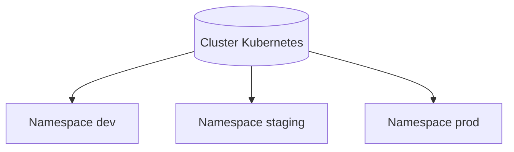

# 01 - Namespaces

## O que é um namespace no Kubernetes

Namespace é um recurso de isolamento lógico dentro de um mesmo cluster.
Ele separa aplicações, equipes e ambientes sem precisar criar um cluster novo para cada cenário.

Uma analogia simples: pense no cluster como um prédio comercial e cada namespace como um andar. Todos usam a mesma estrutura física, mas cada andar tem seu próprio espaço e organização.

## Por que namespaces são úteis

- Organização de workloads por time, produto ou ambiente
- Redução de conflito de nomes de recursos
- Aplicação de políticas por escopo (quotas, limites, RBAC)
- Facilita operação e troubleshooting

## Diferença entre ambiente dev, staging e prod

- `dev`: ambiente de desenvolvimento rápido, com mudanças frequentes
- `staging`: ambiente de homologação, o mais próximo possível de produção
- `prod`: ambiente de produção, com foco em estabilidade, segurança e disponibilidade

Separar esses ambientes por namespace ajuda a reduzir risco operacional e melhora governança.

## Diagrama de namespaces



## Como criar namespaces via YAML

Neste laboratório, os namespaces são declarados em manifests:

- `manifests/namespaces/namespace-dev.yaml`
- `manifests/namespaces/namespace-staging.yaml`
- `manifests/namespaces/namespace-prod.yaml`

Cada arquivo define um objeto `Namespace` com seu respectivo nome.

## Como criar objetos dentro de namespaces

Para criar objetos dentro de um namespace, declare `metadata.namespace` no YAML.

Exemplos deste laboratório:

- `manifests/namespaces/app-dev.yaml`: cria um Deployment `web-dev` no namespace `dev`
- `manifests/namespaces/service-dev.yaml`: cria um Service `ClusterIP` para o app `web-dev` no namespace `dev`

## Como listar objetos por namespace

Você pode listar recursos de forma segmentada com `-n <namespace>`, por exemplo:

- pods do `dev`
- services do `dev`

Isso evita misturar informações de ambientes diferentes.

## Como trocar o namespace padrão usando kubectl config

É possível definir namespace padrão no contexto atual do `kubectl`, evitando repetir `-n` em todos os comandos.

Exemplo:

```bash
kubectl config set-context --current --namespace=dev
```

Depois disso, comandos como `kubectl get pods` passam a consultar `dev` por padrão.

## Diferença entre objetos namespaced e objetos cluster-scoped

### Objetos namespaced (existem dentro de um namespace)

- Pod
- Deployment
- Service
- ConfigMap
- Secret
- ResourceQuota
- LimitRange

### Objetos cluster-scoped (escopo global do cluster)

- Namespace
- Node
- PersistentVolume
- ClusterRole
- ClusterRoleBinding
- StorageClass

## Comandos do laboratório e explicação

```bash
kubectl apply -f manifests/namespaces/
kubectl get namespaces
kubectl get pods -n dev
kubectl get svc -n dev
kubectl describe namespace dev
kubectl config set-context --current --namespace=dev
```

Explicação de cada comando:

- `kubectl apply -f manifests/namespaces/`
Aplica todos os manifests da pasta (namespaces, deployment e service).

- `kubectl get namespaces`
Lista os namespaces do cluster para validar criação (`dev`, `staging`, `prod`).

- `kubectl get pods -n dev`
Lista os pods somente no namespace `dev`.

- `kubectl get svc -n dev`
Lista os services somente no namespace `dev`.

- `kubectl describe namespace dev`
Mostra detalhes do namespace `dev` (labels, eventos e status).

- `kubectl config set-context --current --namespace=dev`
Define `dev` como namespace padrão no contexto atual do `kubectl`.
