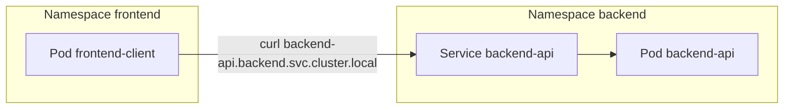

# 02 - Comunicação entre Namespaces com DNS

## Objetivo

Demonstrar como serviços em namespaces diferentes se comunicam usando o DNS interno do Kubernetes.

Neste cenário:

- o backend roda no namespace `backend`
- o cliente roda no namespace `frontend`
- o cliente acessa o serviço do backend pelo nome DNS, sem usar IP fixo

## Descoberta de serviços (Service Discovery) no Kubernetes

Service discovery é o mecanismo de descobrir "onde está" um serviço em tempo de execução.
No Kubernetes, isso é feito por DNS interno (CoreDNS), que cria nomes estáveis para Services.

Vantagem prática: mesmo que os Pods mudem de IP, o nome do Service continua o mesmo.

## ClusterIP e comunicação interna

`ClusterIP` é o tipo padrão de Service no Kubernetes.

- ele expõe o serviço apenas dentro do cluster
- não abre acesso direto externo
- é ideal para comunicação interna entre microsserviços

## DNS curto e DNS completo

Dentro do Kubernetes, um Service pode ser resolvido por:

- DNS curto no mesmo namespace: `backend-api`
- DNS com namespace: `backend-api.backend`
- DNS completo (FQDN): `backend-api.backend.svc.cluster.local`

Formato completo:

`service.namespace.svc.cluster.local`

## Por que isso é importante em microsserviços

Em arquiteturas de microsserviços, frontend, backend, autenticação e dados costumam estar separados.
DNS interno com Service permite:

- desacoplamento entre serviços
- menor dependência de IP e infraestrutura
- comunicação estável entre componentes
- operação mais segura dentro do cluster

## Diagrama de comunicação DNS



## Manifests deste laboratório

- `manifests/dns-cross-namespace/backend-namespace.yaml`
- `manifests/dns-cross-namespace/frontend-namespace.yaml`
- `manifests/dns-cross-namespace/backend-deployment.yaml`
- `manifests/dns-cross-namespace/backend-service.yaml`
- `manifests/dns-cross-namespace/frontend-pod.yaml`

## Como aplicar

```bash
kubectl apply -f manifests/dns-cross-namespace/
```

## Testes de comunicação

Entre no pod cliente:

```bash
kubectl exec -n frontend -it frontend-client -- sh
```

Dentro do shell do pod, execute:

```bash
curl backend-api.backend.svc.cluster.local
```

Se a comunicação estiver correta, você verá o HTML padrão do nginx retornado pelo backend.

## Verificações úteis

```bash
kubectl get pods -n backend
kubectl get svc -n backend
kubectl get pods -n frontend
kubectl get endpoints -n backend backend-api
```

Se houver falha de resolução/conexão, valide:

- se o Service `backend-api` existe no namespace `backend`
- se o Service tem endpoints (pods prontos)
- se o pod `frontend-client` está em `Running`
- se CoreDNS está saudável no namespace `kube-system`
