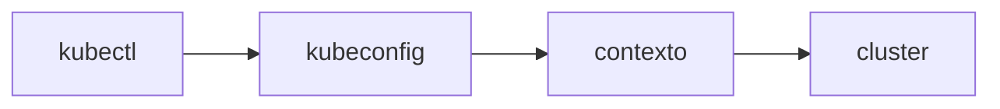

# 03 - Múltiplos Clusters e Kubeconfig

## O que é kubeconfig

`kubeconfig` é o arquivo de configuração que o `kubectl` usa para saber:

- em qual cluster conectar
- qual credencial usar
- qual contexto está ativo

Sem ele, o `kubectl` não sabe para onde enviar comandos.

## Onde geralmente fica o arquivo

Por padrão, o arquivo principal fica em:

`~/.kube/config`

No Windows com WSL2, esse caminho é dentro da distribuição Linux (ex.: Ubuntu).

## O que são clusters, users e contexts no kubeconfig

- `clusters`: definem endpoint da API e certificados do cluster
- `users`: definem credenciais (token, certificado, `exec` plugin etc.)
- `contexts`: combinam `cluster + user + namespace`

Pense no contexto como um "perfil ativo de trabalho".

## Fluxo de uso



## Comandos essenciais do kubectl config

```bash
kubectl config get-contexts
kubectl config current-context
kubectl config use-context NOME_DO_CONTEXTO
kubectl config view
kubectl config set-context --current --namespace=dev
```

Explicação prática:

- `kubectl config get-contexts`
Lista todos os contextos disponíveis no kubeconfig.

- `kubectl config current-context`
Mostra qual contexto está ativo agora.

- `kubectl config use-context NOME_DO_CONTEXTO`
Troca para outro contexto (outro cluster/credencial/namespace padrão).

- `kubectl config view`
Exibe o conteúdo consolidado do kubeconfig.

- `kubectl config set-context --current --namespace=dev`
Define `dev` como namespace padrão no contexto atual.

## Como usar múltiplos clusters

Você pode manter vários contextos no mesmo kubeconfig, por exemplo:

- `kind-lab-dev`
- `kind-lab-staging`
- `kind-lab-prod`

Assim, a troca de cluster é feita só com `kubectl config use-context ...`, sem editar arquivo manualmente a cada mudança.

## Como fazer merge de kubeconfig

Quando você tem dois arquivos (por exemplo, cluster atual + outro cluster), pode unir os dois:

```bash
export KUBECONFIG=~/.kube/config:~/outro-cluster.yaml
kubectl config view --flatten > ~/.kube/config-merged
mv ~/.kube/config-merged ~/.kube/config
```

Após o merge, rode:

```bash
kubectl config get-contexts
```

para confirmar que os contextos dos dois arquivos aparecem juntos.

## Como usar kubectx e kubens

`kubectx` e `kubens` tornam a navegação mais rápida:

- `kubectx`: troca de contexto
- `kubens`: troca de namespace

Exemplo:

```bash
kubectx
kubectx kind-lab-dev
kubens
kubens dev
```

## Atenção

Manipular `kubeconfig` exige cuidado: um merge ou `mv` errado pode sobrescrever acessos existentes e remover contextos importantes.

Boas práticas:

- faça backup antes de alterar (`cp ~/.kube/config ~/.kube/config.bkp`)
- valide contextos após cada merge (`kubectl config get-contexts`)
- confirme o contexto atual antes de aplicar manifests em ambientes críticos
