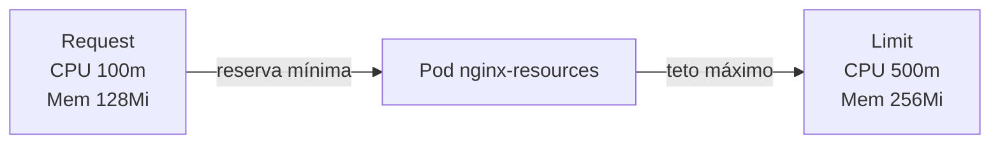

# 04 - Requests e Limits de Recursos

## O que é Metrics Server

Metrics Server é um componente do Kubernetes que coleta métricas de uso de CPU e memória dos nós e pods.

Ele alimenta comandos como:

- `kubectl top pods`
- `kubectl top nodes`

## Por que ele é usado

Sem métricas, é difícil tomar decisão sobre dimensionamento e limites.
Com Metrics Server, você consegue observar consumo real e ajustar requests/limits com base em dados.

## Request vs Limit (explicação simples)

- **Request = reserva mínima solicitada**
- **Limit = teto máximo permitido**

Em termos práticos:

- request ajuda o scheduler a decidir onde o pod pode ser alocado
- limit protege o cluster contra consumo exagerado de um único container

## Diagrama de requests e limits



## CPU request

É a quantidade mínima de CPU reservada para o container.
Exemplo: `100m` significa 0.1 de vCPU.

## CPU limit

É o limite máximo de CPU que o container pode consumir.
Exemplo: `500m` significa até 0.5 de vCPU.

Se o container tentar usar mais que isso, ele sofre **throttling** (o uso de CPU é limitado).

## Memory request

É a memória mínima considerada no agendamento do pod.
Exemplo: `128Mi`.

## Memory limit

É o teto de memória que o container pode usar.
Exemplo: `256Mi`.

Se o container ultrapassar esse limite, ele pode ser finalizado com **OOMKilled**.

## O que acontece ao ultrapassar limites

### Limite de CPU

O processo não é morto imediatamente, mas tem uso reduzido por throttling. Resultado comum: aplicação mais lenta.

### Limite de memória

Quando passa do limite, o kernel pode encerrar o processo/container por falta de memória (`OOMKilled`).

## Por que definir requests e limits é boa prática

- melhora previsibilidade do ambiente
- evita que um pod monopolize recursos
- reduz risco de instabilidade em cluster compartilhado
- facilita troubleshooting e capacidade de planejamento

## Manifests deste laboratório

- `manifests/resources/app-with-requests-limits.yaml`
- `manifests/resources/stress-pod.yaml`

## Comandos de execução e validação

```bash
kubectl apply -f manifests/resources/
kubectl top pods -n resources-lab
kubectl describe pods -n resources-lab -l app=nginx-resources
```

Leitura rápida dos comandos:

- `kubectl apply -f manifests/resources/`
Aplica namespace, deployment com requests/limits e pod de stress.

- `kubectl top pods -n resources-lab`
Mostra consumo atual de CPU e memória dos pods no namespace `resources-lab`.

- `kubectl describe pods -n resources-lab -l app=nginx-resources`
Mostra detalhes dos pods do app, incluindo eventos e recursos.

## Observação

Para usar `kubectl top`, o Metrics Server precisa estar instalado e funcionando.
