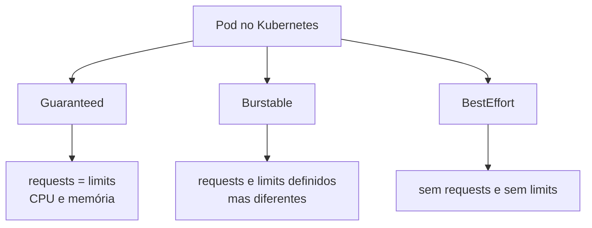

# 05 - QoS no Kubernetes

QoS (Quality of Service) define como o Kubernetes classifica pods em cenários de pressão de recursos no nó.

## Tipos de QoS

### Guaranteed

Acontece quando o pod tem `requests` e `limits` de **CPU e memória**, e os valores são iguais.

Exemplo de regra:

- `requests.cpu = limits.cpu`
- `requests.memory = limits.memory`

### Burstable

Acontece quando o pod tem `requests` e `limits` definidos, mas diferentes, ou quando apenas parte dos recursos está definida.

Exemplos:

- request menor que limit
- só CPU com request/limit definido
- só memória com request/limit definido

### BestEffort

Acontece quando o pod não define `requests` nem `limits`.

## Diagrama de classes de QoS



## Tabela comparativa

| Classe QoS | Configuração de recursos | Comportamento geral |
|---|---|---|
| Guaranteed | Requests e limits iguais para CPU e memória | Maior previsibilidade e prioridade em pressão de recursos |
| Burstable | Requests e limits definidos, porém diferentes, ou parcialmente definidos | Equilíbrio entre reserva mínima e elasticidade |
| BestEffort | Sem requests e sem limits | Menor prioridade; mais suscetível a evicção |

## Manifests deste laboratório

- `manifests/qos/namespace-qos.yaml`
- `manifests/qos/pod-guaranteed.yaml`
- `manifests/qos/pod-burstable.yaml`
- `manifests/qos/pod-besteffort.yaml`

## Comandos

```bash
kubectl apply -f manifests/qos/
kubectl get pods -n qos-lab
kubectl describe pod pod-guaranteed -n qos-lab
kubectl describe pod pod-burstable -n qos-lab
kubectl describe pod pod-besteffort -n qos-lab
```

## Como encontrar a classe QoS no describe

Na saída do `kubectl describe pod ...`, procure pela linha:

`QoS Class:`

Exemplo esperado:

- `QoS Class: Guaranteed`
- `QoS Class: Burstable`
- `QoS Class: BestEffort`

Essa linha confirma que o Kubernetes classificou o pod corretamente com base nos recursos declarados.
