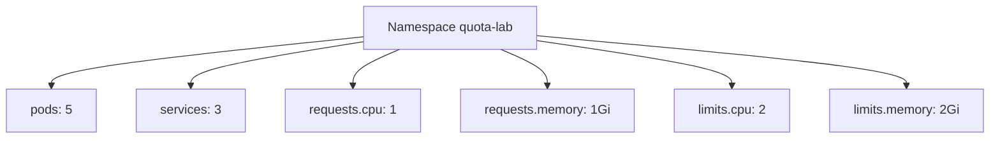

# 07 - ResourceQuota

## O que é ResourceQuota

`ResourceQuota` é uma política de limite por namespace.
Ela controla o consumo total de recursos e também a quantidade de objetos criados.

Em vez de olhar pod por pod, a quota enxerga o namespace como um todo.

## Diferença entre LimitRange e ResourceQuota

- `LimitRange`: atua no nível de pod/container (mínimo, máximo e padrões por workload).
- `ResourceQuota`: atua no nível do namespace (teto agregado de uso e de objetos).

Resumo prático:

- `LimitRange` organiza o tamanho de cada pod.
- `ResourceQuota` controla o orçamento total do namespace.

## Como ResourceQuota limita recursos e objetos

Com `ResourceQuota`, você consegue limitar:

- CPU e memória solicitadas (`requests.cpu`, `requests.memory`)
- CPU e memória máximas (`limits.cpu`, `limits.memory`)
- número de pods
- número de services
- número de configmaps
- número de secrets

## Por que ResourceQuota é importante em ambientes multi-time

Em ambientes compartilhados, sem quota um time pode consumir recursos demais e afetar os demais.

A quota traz:

- previsibilidade de capacidade
- isolamento de consumo entre times
- proteção do cluster contra crescimento descontrolado de objetos

## Exemplo de uso em dev, staging e prod

- `dev`: quotas menores para testes rápidos e baixo custo
- `staging`: quotas intermediárias para homologação realista
- `prod`: quotas maiores, alinhadas a SLO e criticidade do serviço

Esse modelo ajuda a equilibrar custo, estabilidade e governança entre ambientes.

## Diagrama de ResourceQuota



## Manifests deste laboratório

- `manifests/resourcequota/namespace-quota.yaml`
- `manifests/resourcequota/resourcequota-compute.yaml`
- `manifests/resourcequota/resourcequota-objects.yaml`
- `manifests/resourcequota/deployment-with-quota.yaml`
- `manifests/resourcequota/deployment-exceed-quota.yaml`

## Comandos

```bash
kubectl apply -f manifests/resourcequota/
kubectl describe quota -n quota-lab
kubectl get resourcequota -n quota-lab
kubectl apply -f manifests/resourcequota/deployment-exceed-quota.yaml
```

Observação importante:

O diretório `manifests/resourcequota/` inclui o manifesto didático `deployment-exceed-quota.yaml`.
Por isso, ao executar `kubectl apply -f manifests/resourcequota/`, pode aparecer erro esperado de quota excedida no final da execução.

Ao usar `scripts/apply-all.sh` ou `make apply`, esse arquivo didático **não** é aplicado automaticamente para manter o fluxo principal estável.
Para reproduzir o erro de quota de forma controlada, aplique manualmente `deployment-exceed-quota.yaml`.

Leitura prática:

- `kubectl apply -f manifests/resourcequota/`
Aplica namespace, quotas e deployments; pode incluir erro esperado no manifesto de teste negativo.

- `kubectl describe quota -n quota-lab`
Mostra `Used` vs `Hard` para cada tipo de limite.

- `kubectl get resourcequota -n quota-lab`
Lista os objetos de quota ativos no namespace.

- `kubectl apply -f manifests/resourcequota/deployment-exceed-quota.yaml`
Tenta criar um deployment que ultrapassa o orçamento de CPU/memória.

## Erro esperado ao exceder quota

Ao exceder a quota, o Kubernetes deve retornar erro `Forbidden` com mensagem de quota excedida (exemplo: `exceeded quota`).

Dependendo do tipo de recurso, o erro pode ocorrer:

- na criação do deployment
- ou na criação dos pods do deployment (eventos do ReplicaSet/Pod)

Nos dois casos, o resultado prático é o mesmo: o workload não sobe por violar a política de quota.
